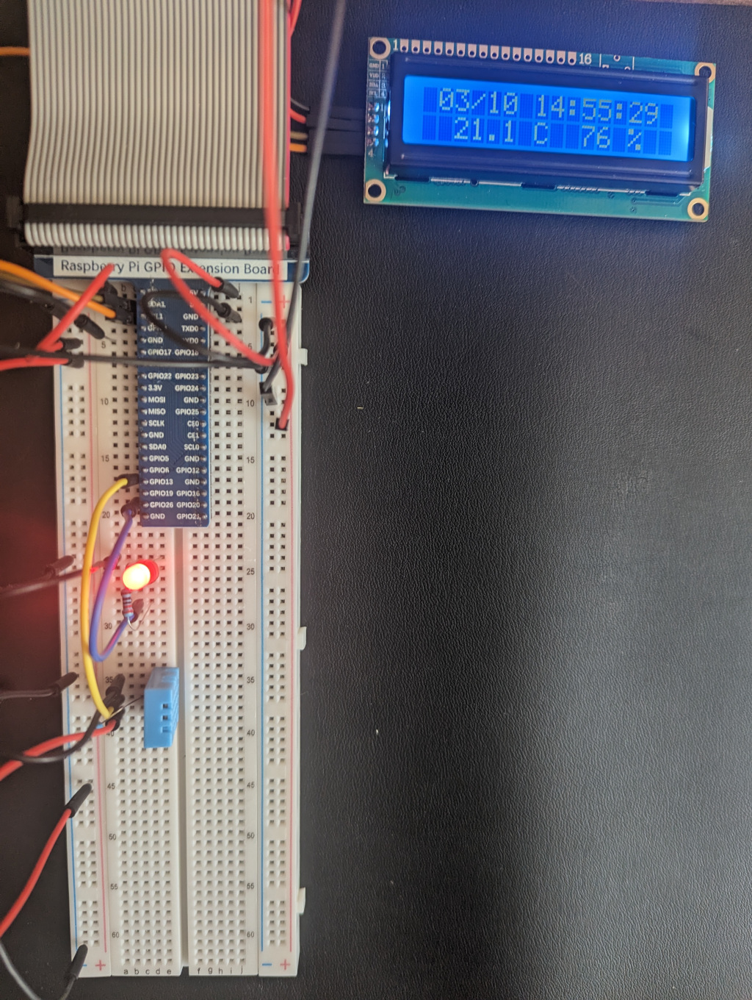

# raspberry pi collector utility

Python collector utility to query the demo device, and compile per-second samples into a Redis
stream (to be consumed by a client service).

The Raspberry Pi has a specific hardwired setup, using Waveshare and Freenove add on devices.

The script writes data to a stream `samples:current` in Redis, storing temperature, humidity,
and light level. This data can be read by a client services, and streamed back to a central
server.

A sample of the output of the collection script:
```
$ ./rpicollect.py 
initialize
Blinker init
Temperature init
LightLevel init
ID Read success  
Display init
Datastore init
Connected to redis on localhost 6379
sample at 14:46:39
Blinker toggle
Temperature sample
humidity=43.00 temperature=20.80
LightLevel sample
voltage=0.88 level=73.33
Display update
Datastore update
Added entry with id 1710107199814-0
....
Cleanup
Blinker shut
Temperature shut
LightLevel shut
Display shut
Datastore shut
```

## External libraries

### Waveshare

Includes the following example library from Waveshare:
* [ADS1256 AD/DA board](https://github.com/waveshare/High-Precision-AD-DA-Board/tree/master/RaspberryPI/ADS1256/python3)

### Freenode

Includes the following example libraries from Freenove:
* [DHT11 Humidity and Temperature Sensor](https://github.com/Freenove/Freenove_Ultimate_Starter_Kit_for_Raspberry_Pi/tree/master/Code/Python_Code/21.1.1_DHT11)
* [Adafruit LCD1602 16x2 Display](https://github.com/Freenove/Freenove_Ultimate_Starter_Kit_for_Raspberry_Pi/tree/master/Code/Python_Code/20.1.1_I2CLCD1602)

## Screenshots


